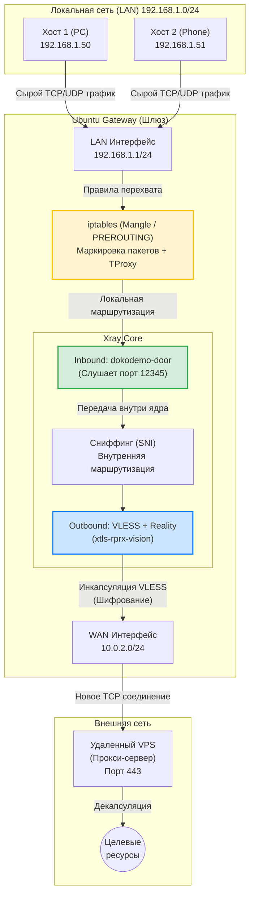

# Network Gateway & Proxy Automation

Репозиторий содержит готовый к использованию Ansible playbook для автоматического развертывания домашнего шлюза на Ubuntu vm.

Проект автоматизирует настройку связки **VLESS + Reality + TProxy**, что позволяет прозрачно маршрутизировать трафик локальной сети через прокси-сервер без необходимости устанавливать сторонние клиенты на конечные устройства.


### Настройка сервера VPS:

1. Устанавливаем xray на сервер с помощью оф скрипта: `bash -c "$(curl -L https://github.com/XTLS/Xray-install/raw/main/install-release.sh)" @ install`
2. После чего служба xray начнет слушать 443 порт, останется только скопировать конфиг server_config.json в директорию `/usr/local/etc/xray/`
3. Переименовать конфиг, иначе демон xray упадет: `mv server_config.json config.json`
4. Генерируем приватный и публичный ключ, а также uuid
   ```
   xray uuid
   xray x25519
   ```
6. Вводим приватный ключ и uuid в `/usr/local/etc/xray/config.json`
7. Перезапуск службы xray: `systemctl restart xray.service`
   

### Настройка шлюза: 

1. Настройка роутера для подключения устройств по стандарту 802.11 (WI-FI).  Для этого можно использовать любой роутер. Перед настройкой шлюза обязательно перевести роутер в режим AP (Access Point) путем отключения WAN и DHCP, после чего роутер будет работать как точка доступа. Затем роутеру обязательно назначить адрес шлюза по умолчанию, адресом шлюза должен являться адрес вашей машины Ubuntu выступающей в роли шлюза, например: Адрес машины `192.168.1.1/24`, адрес роутера `192.168.1.2/24`, шлюзом по умолчанию будет являться `192.168.1.1/24`. Альтернативным вариантом (без роутера) является использование внешнего USB WI-FI адаптера на виртуальной машине ubuntu.
2. Установка ansible:
   ```
   sudo apt update
   sudo apt install ansible
   ```
4. Вводим публичный ключ и uuid в [config.json.j2](https://github.com/lll-32/ubuntu-tproxy-gateway/blob/main/ubuntu_gateway_router/templates/config.json.j2)
5. Запуск ansible: переходим в директорию со скачанным проектом и запускаем playbook: `ansible-playbook -i inventory.ini playbook.yml
`

## Архитектура сети




